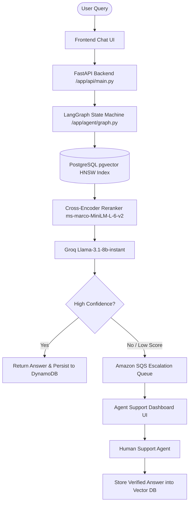

# RAG Customer Care Query Resolution System

[](https://www.python.org/downloads/)
[](https://fastapi.tiangolo.com/)
[](https://react.dev/)
[](https://vitejs.dev/)
[](https://github.com/pgvector/pgvector)
[](https://www.langchain.com/langgraph)
[](https://aws.amazon.com/)
[](LICENSE)

An enterprise-grade Retrieval-Augmented Generation (RAG) system engineered for automated customer support. It leverages a **LangGraph state machine**, two-stage vector retrieval with **Cross-Encoder reranking**, **Amazon SQS human-in-the-loop escalation**, and **DynamoDB session persistence**.

---

## 🏗️ Architecture Overview



---

## ✨ Key Features

* **Two-Stage Retrieval & Cross-Encoder Reranking:** Combines PostgreSQL `pgvector` HNSW vector similarity search with a local cross-encoder reranker (`ms-marco-MiniLM-L-6-v2`). Overfetches candidate chunks (`fetch_k = min(top_k * 4, 30)`) before reranking with deterministic tiebreaker sorting (`ORDER BY embedding <=> %s::vector, id ASC`).
* **Intelligent Self-Correction Loop:** Automatically retries document searches up to 3 times with wider parameters (`top_k` and `min_similarity`) if initial retrieval returns low-confidence context.
* **Deduplicated Vector Ingestion:** Uses SHA-256 content hashing with PostgreSQL `ON CONFLICT DO NOTHING` rules to eliminate duplicate chunk insertions.
* **Isolated Benchmark Suite:** Synthetic benchmark datasets (54k+ rows) are isolated in a separate `documents_benchmark` table, maintaining a lean production corpus (820 chunks).
* **Human-in-the-Loop Escalation:** Low-confidence or unanswerable queries route to human support agents using Amazon SQS queues.
* **Cross-User Knowledge Sharing:** Human-verified answers are automatically embedded and saved back into `pgvector`, enriching future retrieval accuracy.
* **Session Persistence:** Tracks multi-turn conversation history in Amazon DynamoDB for context-aware follow-up handling.
* **Production-Grade Hygiene:** Clean modular structure, FastAPI rate-limiting, PII masking, input sanitization, and strict CORS configuration.

---

## 🛠️ Technology Stack

| Layer | Technology | Details |
| :--- | :--- | :--- |
| **State Machine** | LangGraph | Dynamic multi-step agent flow & self-correction loop |
| **LLM Inference** | Groq API | Llama-3.1-8b-instant model execution |
| **Embeddings** | Amazon Bedrock | Titan Text Embeddings v2 (1024 dimensions) |
| **Reranker** | Sentence-Transformers | Cross-Encoder `ms-marco-MiniLM-L-6-v2` |
| **Vector Database** | Amazon RDS PostgreSQL | `pgvector` extension with HNSW indexing |
| **Session Memory** | Amazon DynamoDB | Session state & turn history persistence |
| **Message Queue** | Amazon SQS | Asynchronous agent escalation queue |
| **File Storage** | Amazon S3 | Source document PDF storage |
| **Backend API** | FastAPI + Uvicorn | Async REST services & dashboard endpoints |
| **Frontends** | React 19 + Vite 8 | User Chat UI & Support Agent Dashboard |

---

## 📁 Repository Structure

```text
rag-system/
├── app/                        # FastAPI Backend Application
│   ├── agent/                  # LangGraph state machine & node handlers
│   ├── api/                    # REST routes (chat, dashboard, rate limiting)
│   ├── archive/                # Amazon S3 file storage integration
│   ├── escalation/             # SQS producer & background worker logic
│   ├── ingestion/              # PDF parsing, text splitting & embedding pipeline
│   ├── memory/                 # DynamoDB session persistence client
│   ├── retrieval/              # pgvector query execution & reranking client
│   └── utils/                  # Config loaders, PII masking & sanitization helpers
├── docs/                       # Project documentation & reference PDF artifacts
├── frontend/                   # Frontend Applications (Vite + React)
│   ├── chat/                   # End-user chat interface
│   └── dashboard/              # Support agent escalation dashboard
├── tests/                      # Pytest Suite & Evaluation Suites (snake_case)
│   ├── bias_fairness/          # Phrasing fairness & bias checks
│   ├── conversation_session_tests/ # Context overflow & session isolation tests
│   ├── edge_case_tests/        # Malformed input & multilingual edge cases
│   ├── escalation_logic_tests/ # Escalation accuracy & SQS writeback tests
│   ├── generation_tests/       # Answer relevance, completeness & refusal tests
│   ├── performance_tests/      # Concurrency & latency benchmarks
│   ├── pipeline_tests/         # Ingestion & embedding schema tests
│   ├── regression_tests/       # Golden-set regression baseline checks
│   ├── retrieval_tests/        # Ranking, multihop & metadata filtering tests
│   ├── safety_tests/           # PII safety & prompt injection detection tests
│   └── vector_database_tests/  # HNSW index, ANN recall & DB health benchmarks
├── .github/workflows/          # GitHub Actions CI/CD pipelines
├── pytest.ini                  # Pytest configuration & markers
├── requirements.txt            # Backend Python dependencies
└── schema.sql                  # PostgreSQL database DDL initialization script
```

---

## ⚡ Quick Start & Installation

### 1. Prerequisites
* **Python**: 3.11 or higher
* **Node.js**: 18+ (for Vite/React frontends)
* **PostgreSQL**: With `pgvector` extension installed
* **AWS Credentials**: Access to Bedrock, RDS, DynamoDB, SQS, S3
* **Groq API Key**: For LLM inference

### 2. Environment Configuration
Copy `.env.example` to `.env` and fill in credentials:
```bash
cp .env.example .env
```
Ensure `GROQ_API_KEY`, AWS credentials, `RDS_*` connection details, and `FRONTEND_ORIGINS` are configured.

### 3. Dependencies
```bash
# Install backend Python dependencies
pip install -r requirements.txt

# Install frontend dependencies
cd frontend/chat && npm install
cd ../dashboard && npm install
```

### 4. Running the Application

#### Start Backend
```bash
uvicorn app.api.main:app --reload
```
> [!NOTE]
> Backend server runs locally at `http://localhost:8000/`. OpenAPI docs available at `http://localhost:8000/docs`.

#### Start Frontends
```bash
# Chat Interface (Port 5173 default)
cd frontend/chat
npm run dev

# Support Agent Dashboard (Port 5174 default)
cd frontend/dashboard
npm run dev
```

---

## 🧪 Testing & Verification

Run backend unit/integration tests and frontend linter/build gates:

```bash
# Run backend test suite (excluding integration tests requiring live AWS/DB tunnel)
python -m pytest tests/ -m "not integration"

# Run frontend linting & production builds
cd frontend/chat && npm run lint && npm run build
cd ../dashboard && npm run lint && npm run build
```

### Measured Performance Highlights
* **Golden-Set Hit Rate:** **18 / 18 queries (100%)** on golden-set retrieval benchmark.
* **ANN Recall@1:** **86.67%** (SLA Target: &ge; 70.0%).
* **HNSW Index Scan:** Verified active via PostgreSQL `EXPLAIN` query plan analysis.
* **Vector Cosine Similarity Match:** **1.000000** between stored and fresh Bedrock embeddings.

---

## 🚀 Deployment

* **Backend:** Automated GitHub Actions pipeline (`.github/workflows/ci.yml` & `cd.yml`). CI runs unit tests; CD connects to AWS EC2 over SSH, updates dependencies, and restarts FastAPI under `supervisorctl` behind Nginx.
* **Frontends:** Both `frontend/chat` and `frontend/dashboard` deploy independently to Vercel upon commits to `main`.
